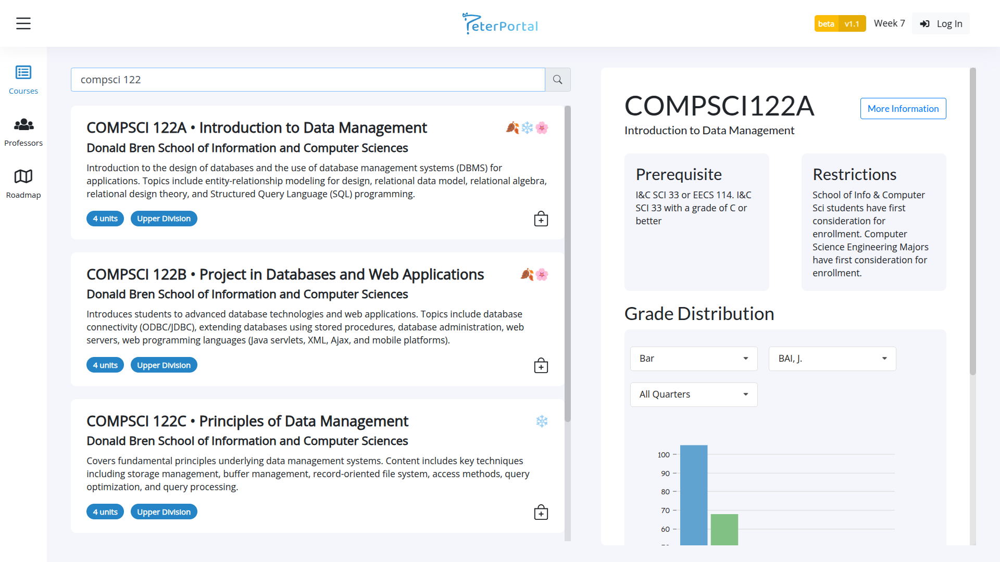
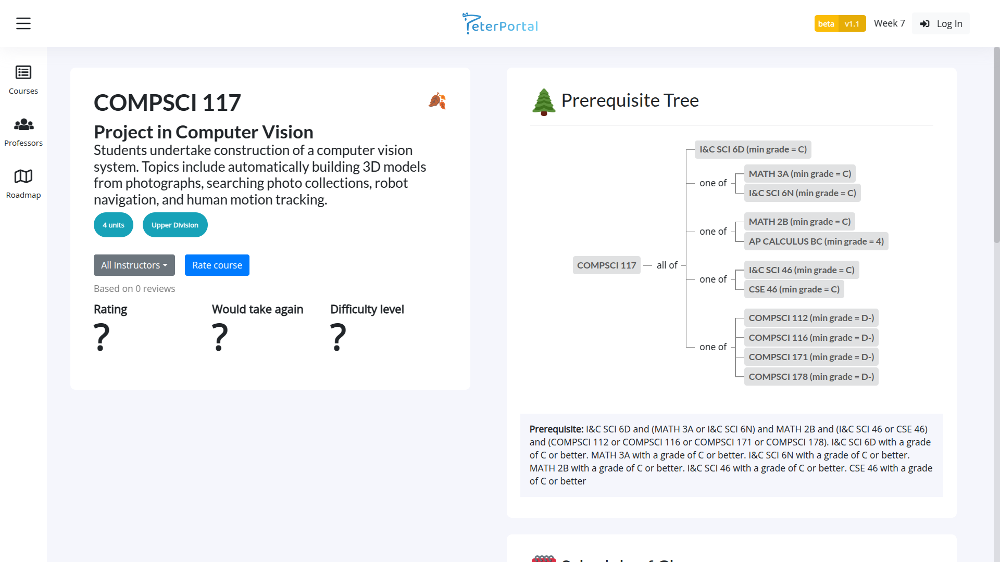
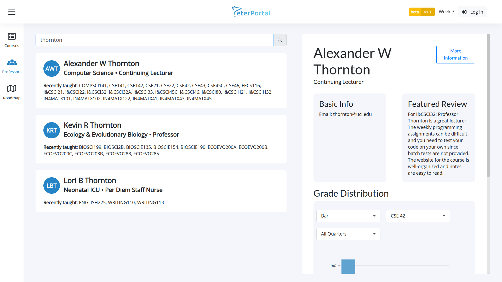
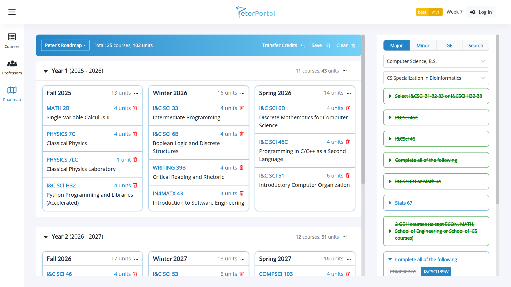

## About

PeterPortal is a web application designed to aid UCI students with course discovery and planning. We consolidate public data available on multiple UCI sources in the application to improve the user experience when planning course schedules.

Features include:

- Course catalog with:
  - Grade distribution graphs/charts
  - Visual prerequisite trees
  - Schedule of classes
  - Reviews




- Professor catalog with:
  - Schedule of classes
  - Grade distribution graphs/charts
  - Reviews


 
- Peter's Roadmap, a drag-and-drop 4-year course planner



## 🔨 Built with

- [Anteater API](https://github.com/icssc/anteater-api)
- Express
- React
- tRPC
- SST
- PostgreSQL
- Drizzle ORM
- TypeScript
- Next.js

## First time setup

### Prerequisites

1. Check your Node version with `node -v`. Make sure you have version 18, 20, or 22 LTS. If you don't, we recommend [nvm](https://github.com/nvm-sh/nvm) to manage node versions (or [nvm-windows](https://github.com/coreybutler/nvm-windows)).

2. We use pnpm as our package manager. If you don't have pnpm, install it with `npm i -g pnpm`

### Committee Members

1. Clone the repository to your local machine:

   ```
   git clone https://github.com/icssc/peterportal-client
   ```

2. `cd` into the cloned repo.

3. Run `pnpm install` to install all node dependencies for the site and API. This may take a few minutes.

4. Setup the appropriate environment variables provided by the project lead.

5. Switch to a branch you will be working on for your current task (pick a name that's relevant to the issue).
   ```
   git checkout -b [branch name]
   ```

### Open Source Contributors

1. Fork the project by clicking the fork button in the top right, above the about section.

2. Clone your forked repository to your local machine

```
git clone https://github.com/<your username>/peterportal-client
```

3. `cd` into the cloned repo.

4. Run `pnpm install` to install all node dependencies for the site and API. This may take a few minutes.

5. Make a copy of the `.env.example` file in the api directory and name it `.env`. This includes the minimum environment variables needed for running the backend.

6. (Optional) Set up your own PostgreSQL database and Google OAuth to be able to test features that require signing in such as leaving reviews or saving roadmaps to your account. Add additional variables/secrets to the .env file from the previous step.

## Open Source Contribution Guide

1. Choose an issue you would like to work on under the issues tab. Leave a comment letting us know you'll work on this issue.

2. We recommend you switch to a branch you will be working on for each feature.

```
git checkout -b [branch name]
```

3. Once your feature is ready, [open a pull request](https://github.com/icssc/peterportal-client/compare) and a member from our team will review it. Follow the pull request template.

## Running the project locally (after setup)

1. Open a terminal in the root directory of the repo.

2. Run `pnpm run dev` to start both the backend Express server and frontend Next.js dev server

3. Visit the link printed to the console by Next.js!

Optionally, you can run the site/api separately by changing into their respective directories in two different terminal windows and running `pnpm run dev`

## Our Mission

🎇 Our mission is to improve the UCI student experience with course planning

## Where does the data come from?

We consolidate our data directly from official UCI sources such as: UCI Catalogue, UCI Public Records Office, and UCI WebReg (courtesy of [Anteater API](https://github.com/icssc/anteater-api)).

## Bug Report

🐞 If you encountered any issues or bug, please open an issue @ https://github.com/icssc/peterportal-client/issues/new

## Other Disclaimer

✅ Although we consolidate our data directly from official UCI sources, this application is by no means an official UCI tool. We strive to keep our data as accurate as possible with the limited support we receive from UCI. Please take this into consideration while using the Website.

## Terms & Conditions

📜 There are no hard policies at the moment for utilizing this tool. However, please refrain from abusing the Website by methods such as: sending excessive amount of requests in a small period of time or purposely looking to exploit the system.
