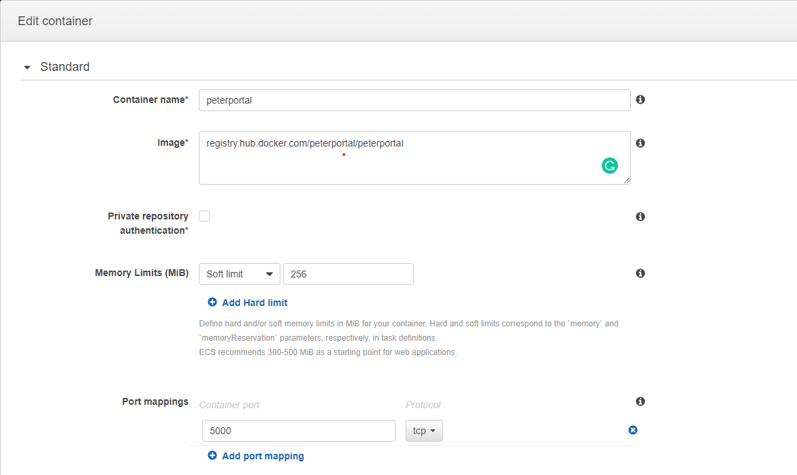
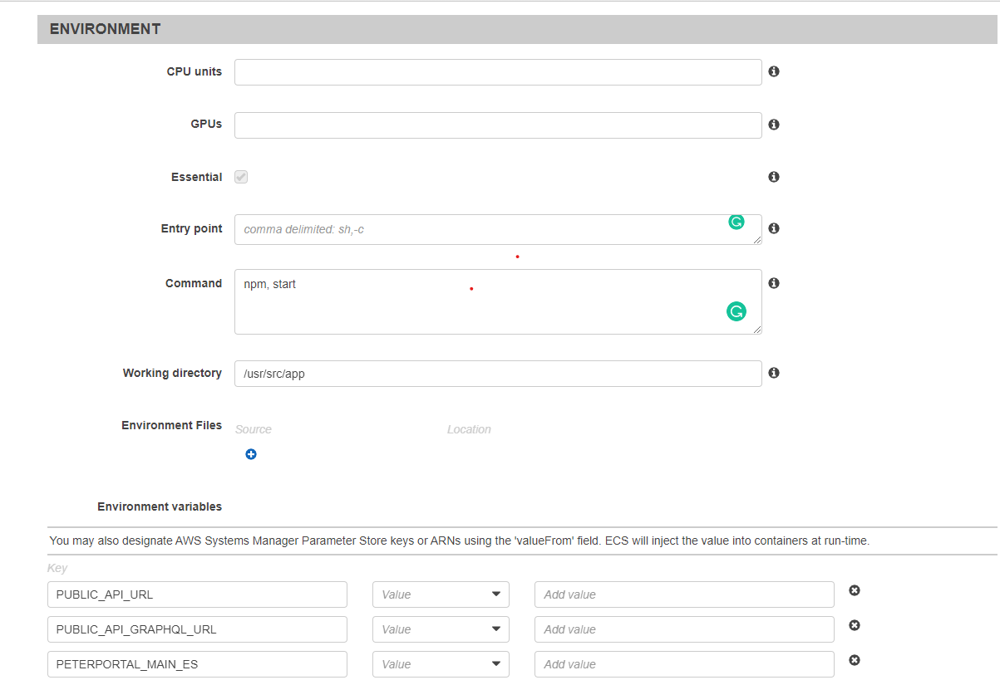
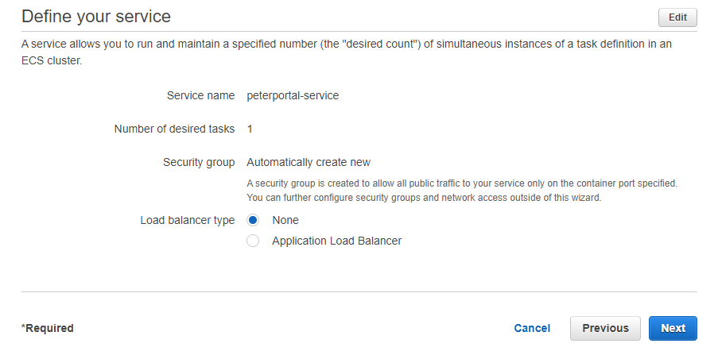
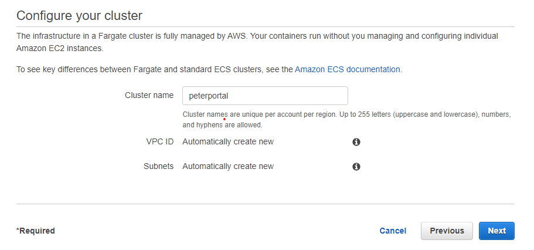
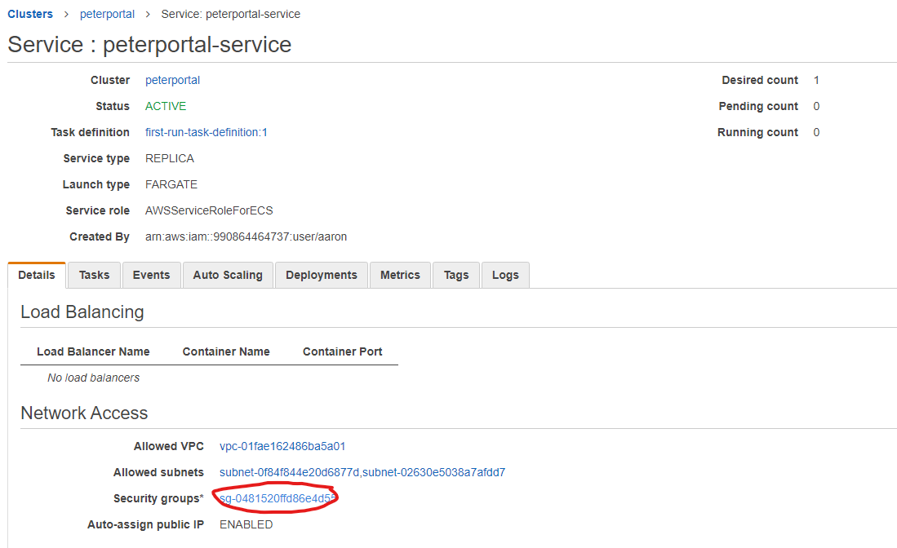
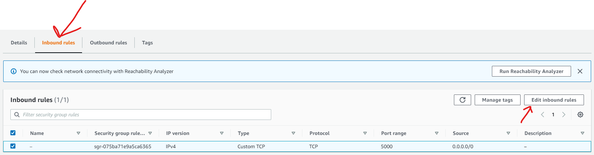
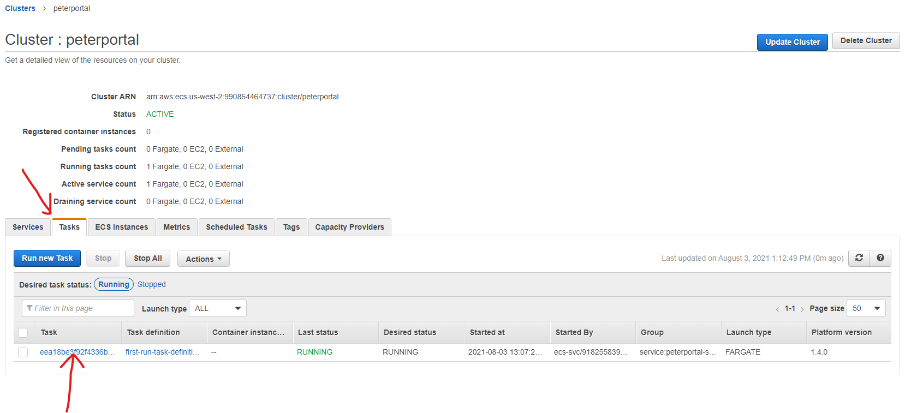
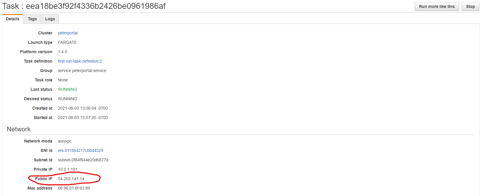
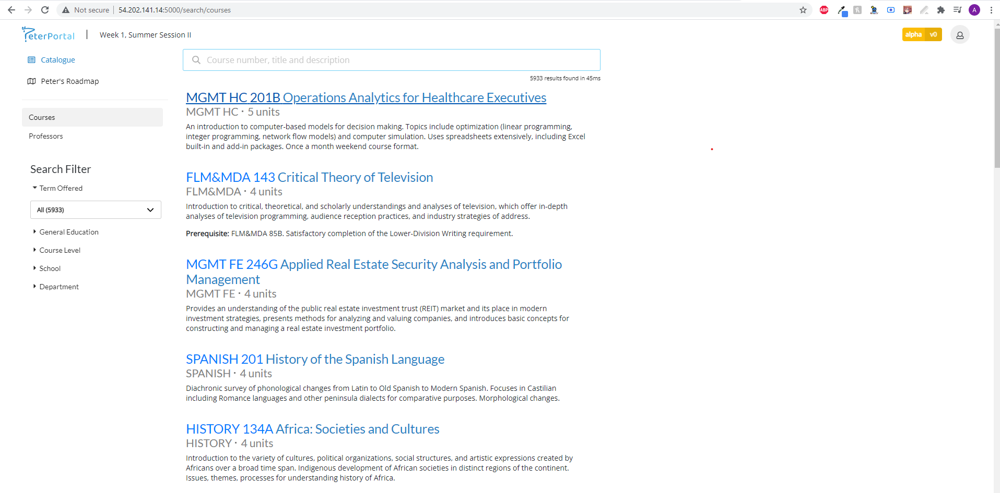

# AWS Configuration
- Alternative Source: https://itnext.io/run-your-containers-on-aws-fargate-c2d4f6a47fda

# Deploy to AWS Fargate  
1. Go to https://us-west-1.console.aws.amazon.com/ecs/home?region=us-west-1#/firstRun
2. Configure custom container definition
- 
    - Container name: peterportal
    - Image: registry.hub.docker.com/peterportal/peterportal (link to dockerhub image)
    - Memory Limits: 256 
    - Port mappings: 5000 (port specified on Express server)
- 
    - Command: npm, start
    - Working directory: /usr/src/app (defined in Dockerfile) 
    - Environment variables: copy over whats in /api/.env
        - Select 'Value' in the middle dropdown for each environment variable
3. Click next on the Container and Task page.
4. Select Application Load Balancer on the Service page.
TODO: Add more pictures
- 
5. Rename the Cluster name and click next on the Cluster page.
- 
6. Click Create on the Review page.
7. Wait for components to be created then click 'View Service'
8. Add port 5000 to incoming traffic in security group if its not there already.
- 
    - View security group
- 
    - Add Inbound Rule if Port 5000 is not included

# Confirm Deployment
1. View the running Task 
- 
2. Open url to <PUBLIC_IP>:5000
- 
    - 54.202.141.14:5000
3. App should be running
- 

# Configure DNS
TODO: Add more pictures
1. Setup Route 53 to point to Public IP.
- https://itnext.io/run-your-containers-on-aws-fargate-c2d4f6a47fda